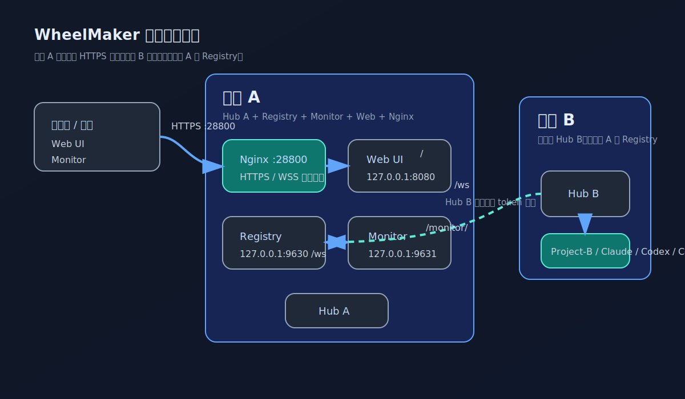
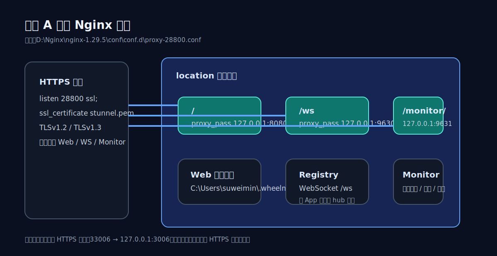
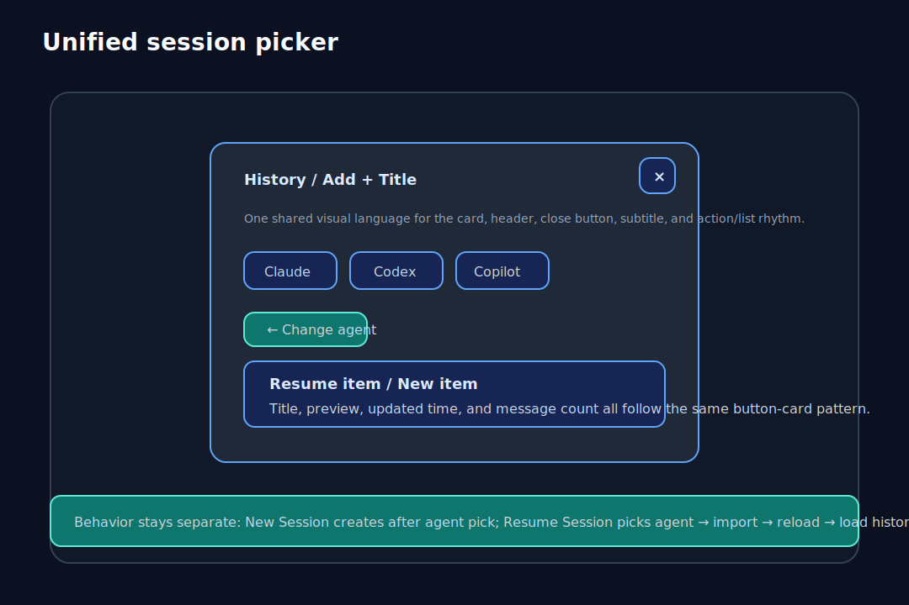
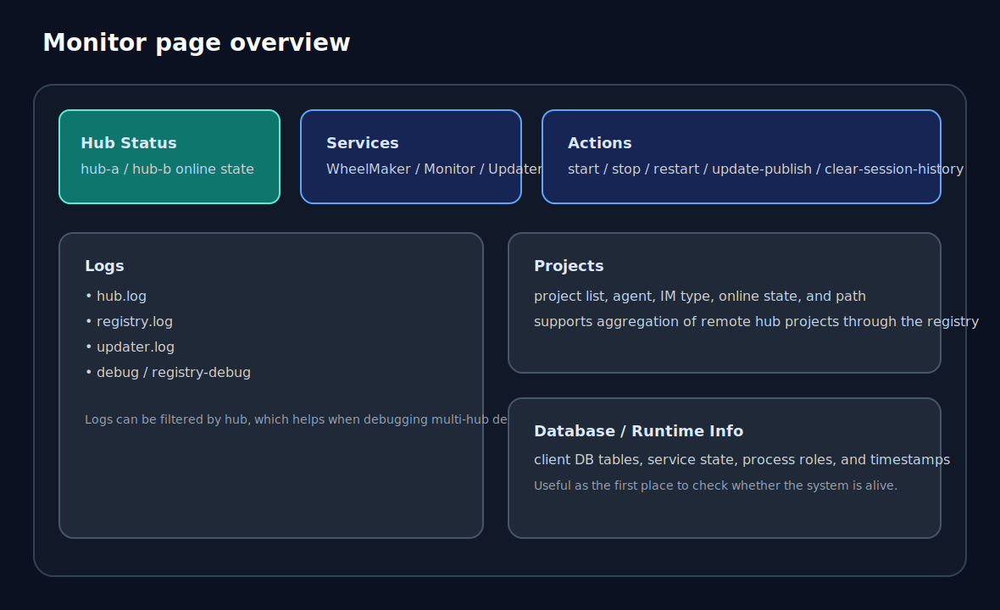

# WheelMaker

WheelMaker is a self-hosted daemon that lets you use AI coding workflows against your local repositories from a phone or a browser.

> Feishu / Mobile App / Web UI → WheelMaker → Claude / Codex / Copilot → your codebase



## Usage

### Deployment model

This README uses the current two-machine shape discussed for this repository:

- **Machine A**
  - runs one hub
  - hosts the registry service
  - hosts the monitor service
  - publishes the Web UI
  - exposes a single HTTPS entrypoint through Nginx
- **Machine B**
  - runs another hub
  - reports its projects to Machine A through the registry
- **Clients**
  - browsers and phones connect to Machine A over HTTPS / WSS

This model works well when you want one machine to expose the public entrypoint while other machines only contribute projects and agents.

### Topology



### Entrypoints and ports

| Location | Endpoint | Purpose |
| --- | --- | --- |
| Machine A / Nginx | `https://<host>:28800/` | Web UI |
| Machine A / Nginx | `wss://<host>:28800/ws` | Registry WebSocket |
| Machine A / Nginx | `https://<host>:28800/monitor/` | Monitor UI |
| Machine A / internal | `127.0.0.1:9630` | Registry listener |
| Machine A / internal | `127.0.0.1:9631` | Monitor listener |

### 1. Refresh, build, and install services

Requirements:

- **Go 1.22+**
- **Node.js 22+**
- an elevated Windows terminal

One-shot refresh:

```bat
deploy.bat
```

Or run the script directly:

```powershell
powershell -NoProfile -ExecutionPolicy Bypass -File scripts/refresh_server.ps1
```

The refresh flow will:

- pull with `git pull --ff-only` when the worktree is clean
- install ACP CLI dependencies if needed
- build `wheelmaker.exe`, `wheelmaker-monitor.exe`, and `wheelmaker-updater.exe`
- deploy binaries to `~\.wheelmaker\bin\`
- preserve or initialize `~\.wheelmaker\config.json`
- generate `start.bat` and `stop.bat`
- register or update these Windows services:
  - `WheelMaker`
  - `WheelMakerMonitor`
  - `WheelMakerUpdater`
- start the services and enable auto-start

If `config.json` is created for the first time, the script stops before restart so you can fill it in and run the same command again.

### 2. Configure Machine A

Edit:

```powershell
notepad ~/.wheelmaker/config.json
```

Example for Machine A:

```json
{
  "projects": [
    {
      "name": "WheelMaker",
      "path": "D:\\Code\\WheelMaker",
      "feishu": {
        "app_id": "cli_xxx",
        "app_secret": "yyy"
      }
    }
  ],
  "registry": {
    "listen": true,
    "port": 9630,
    "server": "127.0.0.1",
    "token": "replace-with-shared-token",
    "hubId": "hub-a"
  },
  "monitor": {
    "port": 9631
  },
  "log": {
    "level": "warn"
  }
}
```

Notes:

- `registry.listen: true` means Machine A hosts the registry server.
- `registry.port` is the internal registry port.
- `registry.token` is shared by other hubs, Web clients, and the monitor login page.
- `wheelmaker-monitor` refuses to start when `registry.token` is empty.
- `registry.hubId` should be stable and recognizable, for example `hub-a`.
- `monitor.port` is the internal monitor port that Nginx forwards to.

### 3. Configure Machine B

Machine B does not expose the public entrypoint. It only reports projects to Machine A.

```json
{
  "projects": [
    {
      "name": "Project-B",
      "path": "D:\\Code\\Project-B",
      "feishu": {
        "app_id": "cli_xxx",
        "app_secret": "yyy"
      }
    }
  ],
  "registry": {
    "listen": false,
    "port": 9630,
    "server": "https://machine-a.example.com:28800",
    "token": "replace-with-shared-token",
    "hubId": "hub-b"
  },
  "monitor": {
    "port": 9631
  },
  "log": {
    "level": "warn"
  }
}
```

Notes:

- `registry.server` can be `https://machine-a.example.com:28800`. WheelMaker will convert it to `wss://.../ws`.
- `registry.token` must match Machine A and is required by the monitor login page.
- `hubId` must be unique, for example `hub-b`.
- `listen: false` means Machine B does not host its own registry listener.

### 4. Nginx + HTTPS example

The current local Nginx installation lives under:

```text
D:\Nginx\nginx-1.29.5\
```

The current routing file is:

```text
D:\Nginx\nginx-1.29.5\conf\conf.d\proxy-28800.conf
```

A deployment-oriented version of that setup looks like this:

```nginx
server {
    listen 28800 ssl;
    server_name _;

    ssl_certificate         D:/Nginx/cert/stunnel.pem;
    ssl_certificate_key     D:/Nginx/cert/stunnel.pem;
    ssl_trusted_certificate D:/Nginx/cert/uca.pem;

    ssl_protocols TLSv1.2 TLSv1.3;

    location / {
        root C:/Users/<YourUser>/.wheelmaker/web;
        index index.html;
        try_files $uri $uri/ /index.html;
    }

    location /ws {
        proxy_pass http://127.0.0.1:9630;
        proxy_http_version 1.1;
        proxy_set_header Upgrade $http_upgrade;
        proxy_set_header Connection "upgrade";
        proxy_set_header Host $host;
        proxy_set_header X-Real-IP $remote_addr;
        proxy_read_timeout 3600s;
        proxy_send_timeout 3600s;
        proxy_buffering off;
    }

    location = /monitor {
        return 301 /monitor/;
    }

    location ^~ /monitor/ {
        proxy_pass http://127.0.0.1:9631;
        proxy_set_header Host $host;
        proxy_set_header X-Real-IP $remote_addr;
        proxy_set_header X-Forwarded-For $proxy_add_x_forwarded_for;
        proxy_set_header X-Forwarded-Proto $scheme;
        proxy_http_version 1.1;
    }
}
```

In this layout:

- `/` serves the published Web UI assets
- `/ws` forwards to the registry WebSocket
- `/monitor/` forwards to the monitor UI

### 5. Publish the Web UI

The Web build is published to:

```text
C:\Users\<YourUser>\.wheelmaker\web
```

Run:

```powershell
cd app
npm run build:web:release
```

This will:

1. build the Web frontend
2. export the assets to `~\.wheelmaker\web`
3. refresh the files served by the Nginx root path

### 6. Install the Web UI as a PWA

WheelMaker Web already ships with:

- `manifest.webmanifest`
- `service-worker.js`
- `display: "standalone"`

So once the site is served over **HTTPS**, modern browsers can install it as a local PWA.

#### Open the app

1. Publish the latest Web build with `npm run build:web:release`.
2. Open `https://<host>:28800/` in a supported browser.
3. Wait until the page finishes loading once so the browser can discover the manifest and register the service worker.

If you open the site through plain HTTP instead of HTTPS, most browsers will not offer PWA install.

#### Install on desktop (Chrome / Edge)

1. Open `https://<host>:28800/`.
2. Look for the **Install app** / **Install WheelMaker** icon in the address bar, or open the browser menu.
3. Choose **Install**.
4. The app will be added locally and launch in a standalone window.

#### Install on Android

1. Open `https://<host>:28800/` in Chrome or Edge.
2. Open the browser menu.
3. Tap **Install app** or **Add to Home screen**.
4. Confirm the prompt.

After installation, WheelMaker can be launched from the app drawer or home screen like a native app.

#### Install on iPhone / iPad

1. Open `https://<host>:28800/` in **Safari**.
2. Tap the **Share** button.
3. Choose **Add to Home Screen**.
4. Confirm the app name and tap **Add**.

On iOS, the installed app opens from the home screen in a standalone-style window.

#### What to expect after installation

- the app opens without normal browser tabs
- the service worker can cache core shell assets
- local notifications and PWA-related capabilities can be enabled by the browser when supported

### 7. Service operations

```powershell
~/.wheelmaker/start.bat
~/.wheelmaker/stop.bat
~/.wheelmaker/refresh_server.ps1
```

Default refresh flow:

```text
update -> build -> stop -> deploy -> restart
```

Optional skips:

- `-SkipUpdate`
- `-SkipBuild`
- `-SkipStop`
- `-SkipDeploy`
- `-SkipRestart`

You can also trigger the updater manually:

```powershell
powershell -NoProfile -ExecutionPolicy Bypass -File scripts/signal_update_now.ps1 -DelaySeconds 30
```

### 8. Quick validation checklist

After deployment:

1. Open `https://<host>:28800/` and confirm the Web UI loads.
2. Open `https://<host>:28800/monitor/`, enter `registry.token`, and confirm the monitor page loads.
3. Confirm Machine B points `registry.server` at Machine A.
4. Confirm both machines use the same `registry.token`.
5. Confirm projects from multiple hubs appear in the UI.
6. Confirm the browser offers **Install app** / **Add to Home Screen** when opened over HTTPS.

### Chat commands

| Command | Description |
| --- | --- |
| `/use <agent>` | Switch the AI agent (`claude`, `codex`, `copilot`) |
| `/new` | Start a new session |
| `/list` | List saved sessions |
| `/load <id>` | Resume a saved session |
| `/cancel` | Cancel the current agent operation |
| `/status` | Show project and agent status |
| `/mode` | Toggle YOLO mode |
| `/model` | Switch agent model |
| `/help` | Show all commands |

## Features

### App workspace overview


The Web app is not only a chat panel. It is a remote workspace that combines project context, sessions, files, Git state, rendering, and connection recovery in one UI.

### 1. Chat and sessions



The app includes full session lifecycle management:

- create new sessions
- resume historical sessions
- switch between session threads
- reload a managed session immediately
- manage sessions across multiple agents
- show session-level config options

The chat view also supports:

- streaming output
- incremental session sync
- full-history hydration
- image attachments
- file link jumps directly from chat content

### 2. Projects and workspace aggregation

The app aggregates registry projects into one workspace view:

- multi-project switching
- project online/offline status
- current agent visibility
- project aggregation across multiple hubs
- direct entry into Chat / File / Git from the same shell

### 3. File browsing and reading

File support goes beyond opening a single text blob:

- directory tree browsing
- file open and cache reuse
- `notModified` short-circuit reads
- pinned files
- file scroll restoration
- file link navigation
- protection for large files and binary files

### 4. Git inspection

The Git view covers the workflows that matter most during remote inspection:

- current branch
- dirty state
- staged / unstaged / untracked summaries
- commit list
- commit file list
- commit diff
- working tree diff
- branch filtering and commit popovers

### 5. Rich rendering

The chat and code surfaces support rich content rendering:

- Markdown
- tables
- KaTeX math
- Mermaid diagrams
- syntax highlighting
- diff rendering
- theme, font, font size, line height, and tab size settings

### 6. Reconnect behavior and PWA support

The app includes behavior aimed at unstable mobile or backgrounded connections:

- silent reconnect
- keeping the workspace visible during reconnect
- on-demand session and file recovery
- PWA support
- local notifications
- service-worker-backed static asset caching

### 7. Settings and observability



WheelMaker also includes a configuration and observability surface:

- runtime and registry address settings
- token provider and token stats, including DeepSeek token stats
- monitor page for service status
- log inspection
- hub and registry project visibility
- operational actions such as start / stop / restart / update-publish

## Repository structure

```text
WheelMaker/
  server/   — Go daemon (hub, agent adapters, registry, monitor)
  app/      — React Native mobile app + Web dashboard
  docs/     — protocols, design docs, and README visual assets
  scripts/  — build, deploy, and update scripts
```

## Development

Server-side:

```powershell
cd server
go run ./cmd/wheelmaker
go test ./...
```

Web-side:

```powershell
cd app
npm test -- --runInBand
npm run tsc:web
npm run build:web:release
```

Script overview:

- `scripts\refresh_server.ps1` — service-first build and deployment
- `scripts\signal_update_now.ps1` — async updater trigger
- `app\scripts\export_web_release.ps1` — export Web assets to `~\.wheelmaker\web`

## License

Private — all rights reserved.
