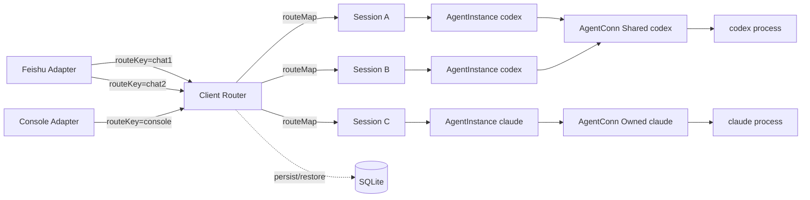
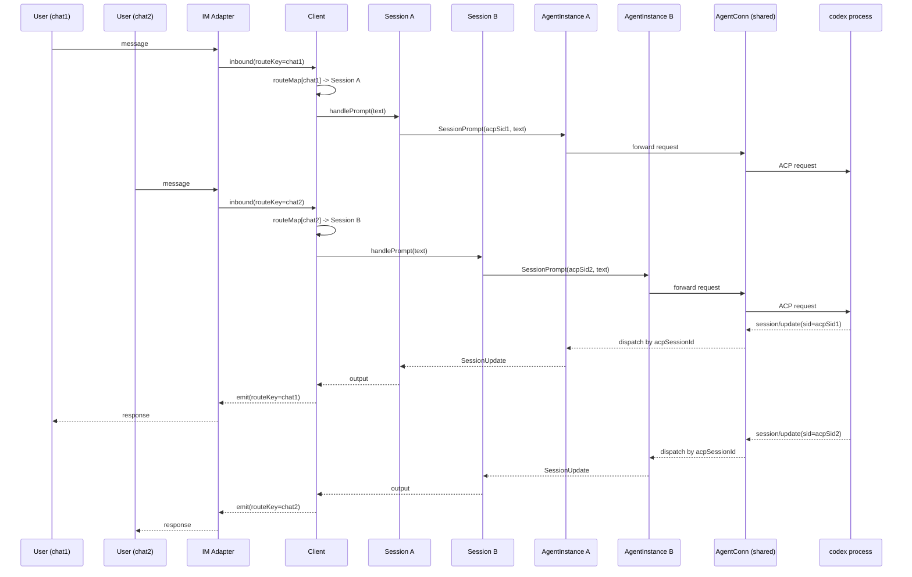

# Architecture 3.0

Updated: 2026-04-03  
Status: **Implemented** (Phases 1-5 complete)  
Full design spec: [specs/2026-04-03-architecture-3.0-multi-session-design.md](superpowers/specs/2026-04-03-architecture-3.0-multi-session-design.md)

## 0. Terms

- Session: WheelMaker business session object. Pure business entity, not bound to any IM route.
- ACP Session: protocol session identified by ACP sessionId. A Session may hold multiple ACP sessionIds (one per agent).
- AgentInstance: runtime executor bound to exactly one Session. The only ACP interface visible to Session.
- AgentConn: ACP connection abstraction used internally by AgentInstance. Hidden from Session.
- AgentFactory: creates AgentInstance and selects AgentConn policy (shared/owned) based on agent capability.
- SessionStore: persistence interface for Session snapshots (SQLite-backed).

Notes:

- Session and ACP Session are related but not identical concepts.
- A Session stores per-agent state in `agents map[string]*SessionAgentState`, preserving acpSessionId and config across agent switches.
- Shared behavior happens at AgentConn, not at AgentInstance.
- Multiple Sessions can be Active simultaneously within one Client.

## 1. Goals

Keep ACP payload unchanged while enabling true multi-session concurrency and clear ownership boundaries:

- Client handles routing/orchestration only (routeKey → Session mapping).
- Session handles lifecycle, agent switching, prompt execution, and terminal management.
- Session does not know about IM routes; it is a pure business object.
- AgentFactory creates AgentInstance and selects AgentConn policy based on `SupportsSharedConn()`.
- AgentInstance handles ACP execution and callback dispatch to its owner Session.
- Sessions can be persisted to SQLite and restored on demand.

## 2. Core Decisions

1. Agent layer is chat/IM agnostic and only speaks ACP semantics.
2. Routing is handled in Client: routeKey (from IM) → Session.
3. Execution is handled in Session: Session → AgentInstance.
4. Each Session always owns exactly one AgentInstance at a time, but stores per-agent state for all agents it has used.
5. AgentFactory does not own runtime connections; it only creates instances and wires AgentConn strategy.
6. AgentConn mode is selected automatically by the agent's self-declared capability (`SupportsSharedConn()`):
   - shared: many AgentInstance objects use one outbound ACP connection.
   - owned: one AgentInstance owns one ACP connection.
7. Agent switching is a session behavior: Session snapshots current agent state, creates new AgentInstance, restores previously saved state if available.
8. Multiple Sessions can be Active concurrently; each has independent promptMu.
9. Session persistence: Active → Suspended → Persisted (SQLite). Restore on `/load`.
10. Client-level commands: `/new`, `/load`, `/list`. Session-level commands: `/use`, `/cancel`, `/status`, `/mode`, `/model`, `/config`.

## 3. Responsibilities

### Client

- Maintain route mapping (routeKey → SessionID). RouteKey is provided by IM adapters.
- Maintain session registry (SessionID → Session). Multiple Sessions can be Active simultaneously.
- Dispatch inbound IM messages to target Session based on routeKey.
- Handle Client-level commands: `/new`, `/load`, `/list`.
- Emit session outputs back to IM via routeKey mapping.
- Manage SessionStore (SQLite) for persistence/restore.

### Session

- Own business session identity (WheelMaker Session ID, UUID).
- Pure business object: no awareness of IM routes.
- Maintain per-agent state map (`agents map[string]*SessionAgentState`), each holding acpSessionId, configOptions, commands, title.
- Own exactly one AgentInstance at a time; switch via snapshot/restore.
- Manage prompt/cancel/config/load/new lifecycle.
- Own a per-session terminalManager.
- Independent promptMu: concurrent Sessions do not block each other.
- Handle Session-level commands: `/use`, `/cancel`, `/status`, `/mode`, `/model`, `/config`.
- Implement `SessionCallbacks` to receive ACP callbacks from AgentInstance.

### AgentFactory

- Create AgentInstance by agent type.
- Self-declare `SupportsSharedConn()` capability.
- Select and inject AgentConn policy (shared or owned) automatically.
- If shared: maintain one shared AgentConn internally; multiple `CreateInstance` calls reuse it.
- If owned: each `CreateInstance` creates an independent AgentConn.

### AgentInstance

- Provide ACP operations (initialize, session/new, session/load, session/prompt, session/cancel).
- Internally hold AgentConn (hidden from Session).
- Dispatch ACP callbacks to its owner Session via SessionCallbacks interface.
- Cache initialize handshake result (initMeta).
- No direct awareness of IM/chat routing.

### AgentConn

- Own/encapsulate ACP transport (Conn/Forwarder) and connection lifecycle.
- Support shared or owned mode.
- In shared mode: implement `acp.ClientCallbacks`, maintain `instances map[acpSessionId]*AgentInstance`, dispatch callbacks by acpSessionId.
- In owned mode: directly forward callbacks to the single AgentInstance.
- Provide request/notification channel for AgentInstance.

## 4. Component Diagram



## 5. Sequence (Shared AgentConn, Multi-Session)



## 6. Session State Machine

```
Created ──▶ Active ──▶ Suspended ──▶ Persisted
              ▲             │              │
              └───── Restored ◀────────────┘

Active ──▶ Closed (cancel + cleanup, no persistence)
```

| Status | Meaning | Memory |
|--------|---------|--------|
| Active | Receiving/processing messages | Full |
| Suspended | User switched to another Session via `/new` or `/load` | Retained, prompt cancelled |
| Persisted | Suspended timeout (default 5 min) or process exit | Only SessionID in index; data in SQLite |
| Restored | Recovered from SQLite back to Active | Full |
| Closed | User explicitly closed | Released |

## 7. Implementation Status

All five phases are implemented and tested. 50 tests pass (43 original + 7 SQLite).

| Phase | Description | Commit | Key Files |
|-------|-------------|--------|-----------|
| 1 | Extract Session type | f3b3d6e | session_type.go, session.go, lifecycle.go, commands.go |
| 2 | Extract AgentInstance + AgentConn | be04073 | agent_conn.go, agent_instance.go, agent_factory.go |
| 3 | Multi-Session routing (RouteKey) | 163b0cf | client.go (routeMap, resolveSession), im.Message.RouteKey |
| 4 | Session persistence (SQLite) | 844e0f9 | session_store.go, sqlite_store.go, sqlite_store_test.go |
| 5 | Cleanup and documentation | (this commit) | architecture-3.0.md, CLAUDE.md |

### What is implemented

- Session extracted as pure business object, decoupled from Client
- AgentConn with ConnOwned/ConnShared modes and per-instance callback dispatch
- AgentInstance as the sole ACP interface visible to Session
- AgentFactoryV2 interface with legacy adapter (wrapLegacyFactory)
- RouteKey-based multi-session routing in Client (routeMap)
- Backward-compatible single-session mode (no route mapping → reuse existing session)
- SessionStore interface + SQLiteSessionStore (CGo-free via modernc.org/sqlite)
- Session.Snapshot(), Session.Suspend(), RestoreFromSnapshot()
- Per-agent state preservation across agent switches (agents map)
- Client-level `/new`, `/load`, `/list` commands with route rebinding
- Timer-driven state machine: Suspended → Persisted after configurable timeout
- Evicted sessions auto-restored from SQLite on incoming message
- Shared AgentConn pooling via sharedAgentFactory, instance registration by acpSessionId
- RegisterAgentV2 API for shared-mode agents

### What remains deferred

- No agent currently declares SupportsSharedConn=true in production (infrastructure ready, needs agent-side opt-in)
- ACP-level `/list` and `/load` commands still delegated to Session; Client-level commands manage WheelMaker sessions independently

## 8. Gap vs Current Code

The gaps listed below reflect the state **before** Architecture 3.0 implementation.
They are preserved for historical reference; all have been addressed in Phases 1-5.

- Current Client holds a single runtime connection (`c.conn`) globally.
- Current `/use` switches agent at client-global scope, not session scope.
- Current route sessions share one forwarder through Client, without explicit AgentInstance object.
- Current callback dispatch is sessionId → Client (single entry), not AgentConn → AgentInstance → Session.
- Current Client supports only one active Session (single `sessionState` field).
- No Session persistence; state.json holds only project-level metadata.
- No RouteKey concept; all IM messages go to the single session.
- No per-agent state snapshot; agent switch discards previous agent's configuration.

## 9. Concurrency and Failure

- Concurrency unit: Session.
- Locking: per-session promptMu; Client mu only protects sessions map + routeMap.
- Callback path: AgentConn → AgentInstance → Session → Client(route) → IM.
- Owned AgentConn failure impacts one session.
- Shared AgentConn failure impacts all attached instances/sessions; requires batch invalidation and coordinated reconnect.
- SQLite concurrent writes: single writer goroutine + WAL mode.
- Session restore failure (SessionLoad fails): fallback to SessionNew.

## 10. Phase Scope

Implementation follows a 5-phase Session-First (bottom-up) approach:

1. **Phase 1**: Extract Session type (single-session behavior preserved)
2. **Phase 2**: Extract AgentInstance + AgentConn
3. **Phase 3**: Multi-Session routing
4. **Phase 4**: Session persistence (SQLite)
5. **Phase 5**: Cleanup and documentation

```
Phase 1 → Phase 2 → Phase 3
                        │
                        ▼
                   Phase 4 → Phase 5
```

Each phase ends with full test pass and no behavioral regression.

Full implementation plan: see [specs/2026-04-03-architecture-3.0-multi-session-design.md](superpowers/specs/2026-04-03-architecture-3.0-multi-session-design.md)

## 11. Open Questions

1. ~~Should routeId always equal chatId, or stay customizable?~~ → RouteKey provided by IM adapter, semantics per adapter.
2. Should one Session allow ACP session migration policies? → Deferred.
3. ~~Unified fallback on session/load failure: retry / new / user prompt?~~ → Fallback to SessionNew on failure.
4. Shared AgentConn reconnect policy: fixed retry vs exponential backoff? → Deferred to implementation.
