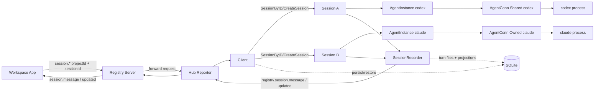
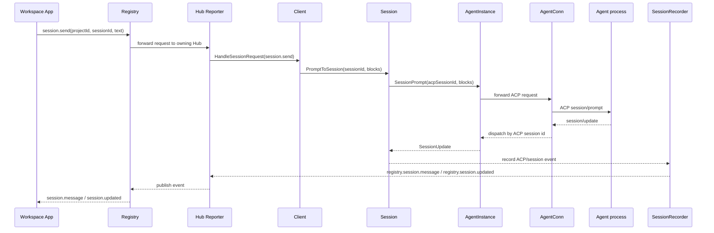

# Architecture 3.0

Updated: 2026-05-27  
Status: **Implemented, App-only session runtime**

## 0. Terms

- App Session: WheelMaker business session identified by `projectId + sessionId` in Registry requests.
- ACP Session: provider protocol session identified by ACP `sessionId`; one WheelMaker Session can hold per-agent ACP state.
- SessionRecorder: the only configured session event outlet. It persists session turns and publishes Registry `session.*` events.
- AgentInstance: runtime executor bound to exactly one Session. The only ACP interface visible to Session.
- AgentConn: ACP connection abstraction used internally by AgentInstance. Hidden from Session.
- AgentFactory: creates AgentInstance and selects AgentConn policy (shared/owned) based on agent capability.
- SessionStore: persistence interface for Session snapshots (SQLite-backed).

Notes:

- Session identity is no longer derived from chat routes. App clients address sessions directly by `projectId + sessionId`.
- A Session stores per-agent state in `agents map[string]*SessionAgentState`, preserving ACP session id and config across agent switches.
- Shared behavior happens at AgentConn, not at AgentInstance.
- Multiple Sessions can be Active simultaneously within one Client.

## 1. Goals

Keep ACP payload unchanged while enabling true multi-session concurrency and clear ownership boundaries:

- Registry accepts App `session.*` requests and forwards them to the owning Hub project.
- Client handles session lookup/orchestration by session id.
- Session handles lifecycle, agent switching, prompt execution, and terminal management.
- Session does not know about external transports; it is a business object.
- SessionRecorder records ACP/session events and publishes `registry.session.message` / `registry.session.updated`.
- AgentFactory creates AgentInstance and selects AgentConn policy based on `SupportsSharedConn()`.
- AgentInstance handles ACP execution and callback dispatch to its owner Session.
- Sessions can be persisted to SQLite and restored on demand.

## 2. Core Decisions

1. Agent layer is App/Registry agnostic and only speaks ACP semantics.
2. Routing is handled by Registry project ownership plus Client session id lookup.
3. Execution is handled in Session: Session -> AgentInstance.
4. Each Session always owns exactly one AgentInstance at a time, but stores per-agent state for all agents it has used.
5. SessionRecorder is the only session message outlet in configured runtime.
6. AgentFactory does not own runtime connections; it only creates instances and wires AgentConn strategy.
7. AgentConn mode is selected automatically by the agent's self-declared capability (`SupportsSharedConn()`):
   - shared: many AgentInstance objects use one outbound ACP connection.
   - owned: one AgentInstance owns one ACP connection.
8. Agent switching is a session behavior: Session snapshots current agent state, creates new AgentInstance, restores previously saved state if available.
9. Multiple Sessions can be Active concurrently; each has independent promptMu.
10. Session persistence: Active -> Suspended -> Persisted (SQLite). Restore by `session.read` / `session.send` session id access.

## 3. Responsibilities

### Registry

- Authenticate hub, client, and monitor roles.
- Track which Hub owns each `projectId`.
- Forward App `session.*`, `fs.*`, and `git.*` requests to the owning Hub.
- Broadcast `session.updated` and `session.message` events to App clients.
- Reject retired chat-style request methods.

### Hub Reporter

- Report project snapshots to Registry.
- Register session request handlers for each project.
- Forward `SessionRecorder` output to Registry as `registry.session.*` events.

### Client

- Maintain session registry (`SessionID -> Session`). Multiple Sessions can be Active simultaneously.
- Resolve App session requests by session id.
- Handle `session.new`, `session.list`, `session.read`, `session.send`, `session.cancel`, archive/delete/reload, and config requests.
- Manage SessionStore (SQLite) for persistence/restore.

### Session

- Own business session identity (WheelMaker Session ID, UUID).
- Maintain per-agent state map (`agents map[string]*SessionAgentState`), each holding ACP session id, configOptions, commands, title.
- Own exactly one AgentInstance at a time; switch via snapshot/restore.
- Manage prompt/cancel/config/load/new lifecycle.
- Own a per-session terminalManager.
- Independent promptMu: concurrent Sessions do not block each other.
- Implement `SessionCallbacks` to receive ACP callbacks from AgentInstance.

### SessionRecorder

- Convert ACP/session events into persisted session turns.
- Publish Registry-facing `session.message` and `session.updated` events.
- Keep session list/read projections aligned with live prompt state.

### AgentFactory

- Create AgentInstance by agent type.
- Self-declare `SupportsSharedConn()` capability.
- Select and inject AgentConn policy (shared or owned) automatically.
- If shared: maintain one shared AgentConn internally; multiple `CreateInstance` calls reuse it.
- If owned: each `CreateInstance` creates an independent AgentConn.

### AgentInstance

- Provide ACP operations (initialize, session/new, session/load, session/prompt, session/cancel).
- Internally hold AgentConn (hidden from Session).
- Dispatch ACP callbacks to its owner Session via SessionCallbacks interface.
- Cache initialize handshake result (initMeta).
- No direct awareness of App or Registry request routing.

## 4. Component Diagram



## 5. Sequence



## 6. Session State Machine

```text
Created -> Active -> Suspended -> Persisted
              ^          |             |
              +-- Restored <-----------+

Active -> Closed (cancel + cleanup, no persistence)
```

| Status | Meaning | Memory |
|--------|---------|--------|
| Active | Receiving/processing messages | Full |
| Suspended | Session is idle but recoverable | Retained, prompt cancelled |
| Persisted | Suspended timeout or process exit | Only SessionID in index; data in SQLite |
| Restored | Recovered from SQLite back to Active | Full |
| Closed | User explicitly closed | Released |

## 7. Current Implementation Status

- App conversations use Registry `session.*` requests only.
- Session output is recorded by SessionRecorder and published through Registry session events.
- Typed slash commands and chat-style route keys have been removed from runtime.
- Retired chat adapter runtimes have been removed.
- Route binding DB table remains as inert migration schema only; production code does not query or expose it.

## 8. Historical Context

The original Architecture 3.0 rollout used chat route keys and command routing while multi-session support was being introduced. That design has been retired. Current code should be read through the App-only Registry/session model above.
