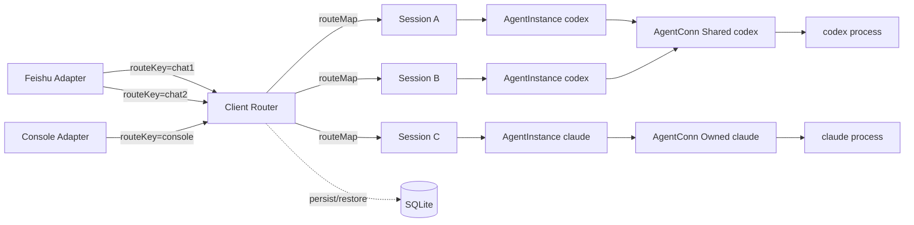
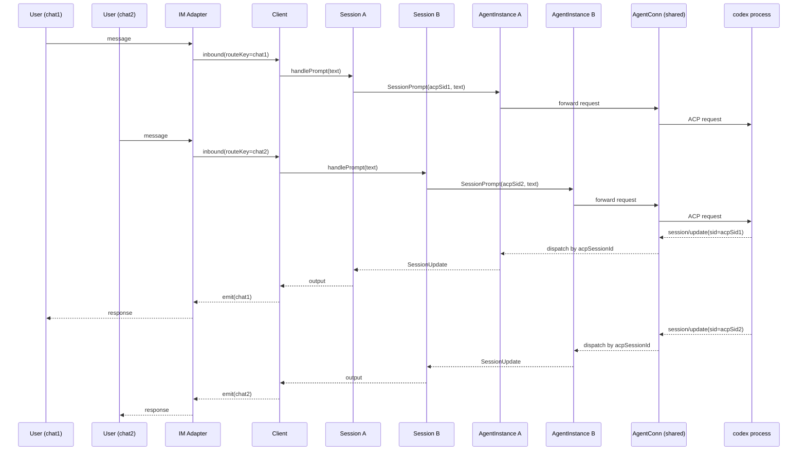

# Architecture 3.0 — Multi-Session Concurrency Design

Updated: 2026-04-03
Status: Approved

## 0. Background

WheelMaker's current server architecture uses a single-session-per-Client model: one ACP connection, one active sessionId, one prompt at a time. This design blocks multi-user IM conversations, cross-platform concurrent usage, and session persistence/recovery.

Architecture 3.0 introduces explicit Session, AgentInstance, and AgentConn types to enable true multi-session concurrency within a single Client (project).

## 1. Design Decisions

| Decision | Conclusion |
|----------|-----------|
| Multi-Session triggers | Same IM new-conversation isolation + multi IM channel convergence |
| AgentConn strategy | Agent self-declares `SupportsSharedConn()`; AgentFactory selects shared/owned automatically |
| Old Session handling | Persist to SQLite after suspension, release memory; restore on demand |
| Session ↔ Route | Decoupled. Route mapping is Client's responsibility; Session is a pure business object |
| Session ↔ Agent | One Session stores per-agent state (`map[string]*SessionAgentState`); agent switch preserves both sides |
| Concurrency | Multiple Sessions can be Active simultaneously; each Session has its own promptMu |
| AgentConn visibility | Session only sees AgentInstance; AgentConn is internal to AgentInstance |

## 2. Core Types

### 2.1 Session

```go
type SessionStatus int
const (
    SessionActive    SessionStatus = iota
    SessionSuspended
    SessionPersisted
)

type Session struct {
    ID           string
    Status       SessionStatus

    // current agent binding
    instance     *AgentInstance
    // per-agent metadata (key = agent name)
    agents       map[string]*SessionAgentState

    // runtime state (moved from Client)
    ready        bool
    initializing bool
    lastReply    string
    replayH      func(acp.SessionUpdateParams)
    prompt       promptState
    terminals    *terminalManager

    createdAt    time.Time
    lastActiveAt time.Time

    mu           sync.Mutex  // protects session internal state
    promptMu     sync.Mutex  // serializes prompt + agent switch within this session
}
```

### 2.2 SessionAgentState

Per-agent metadata within one Session. Preserved across agent switches.

```go
type SessionAgentState struct {
    ACPSessionID  string
    ConfigOptions []acp.ConfigOption
    Commands      []acp.AvailableCommand
    Title         string
    UpdatedAt     string
}
```

### 2.3 AgentInstance

The only ACP interface visible to Session. Hides connection details.

```go
type AgentInstance struct {
    name       string
    conn       *AgentConn       // hidden from Session
    callbacks  SessionCallbacks // routes callbacks to owner Session
    initMeta   clientInitMeta   // cached initialize result
}
```

Public methods (Session can call):

```go
func (ai *AgentInstance) Name() string
func (ai *AgentInstance) Initialize(ctx context.Context, params acp.InitializeParams) (acp.InitializeResult, error)
func (ai *AgentInstance) SessionNew(ctx context.Context, params acp.SessionNewParams) (acp.SessionNewResult, error)
func (ai *AgentInstance) SessionLoad(ctx context.Context, params acp.SessionLoadParams) (acp.SessionLoadResult, error)
func (ai *AgentInstance) SessionList(ctx context.Context, params acp.SessionListParams) (acp.SessionListResult, error)
func (ai *AgentInstance) SessionPrompt(ctx context.Context, params acp.SessionPromptParams) (acp.SessionPromptResult, error)
func (ai *AgentInstance) SessionCancel(sessionID string) error
func (ai *AgentInstance) SessionSetConfigOption(ctx context.Context, params acp.SessionSetConfigOptionParams) ([]acp.ConfigOption, error)
```

### 2.4 SessionCallbacks

Interface that Session implements, used by AgentInstance to dispatch ACP callbacks.

```go
type SessionCallbacks interface {
    SessionUpdate(params acp.SessionUpdateParams)
    SessionRequestPermission(ctx context.Context, params acp.PermissionRequestParams) (acp.PermissionResult, error)
    FSRead(params acp.FSReadTextFileParams) (acp.FSReadTextFileResult, error)
    FSWrite(params acp.FSWriteTextFileParams) error
    TerminalCreate(params acp.TerminalCreateParams) (acp.TerminalCreateResult, error)
    TerminalOutput(params acp.TerminalOutputParams) (acp.TerminalOutputResult, error)
    TerminalWaitForExit(params acp.TerminalWaitForExitParams) (acp.TerminalWaitForExitResult, error)
    TerminalKill(params acp.TerminalKillParams) error
    TerminalRelease(params acp.TerminalReleaseParams) error
}
```

### 2.5 AgentConn

```go
type ConnMode int
const (
    ConnOwned  ConnMode = iota
    ConnShared
)

type AgentConn struct {
    agent      agent.Agent
    forwarder  *acp.Forwarder
    mode       ConnMode

    // shared mode: routes callbacks by acpSessionId
    mu         sync.RWMutex
    instances  map[string]*AgentInstance  // acpSessionId -> AgentInstance
}
```

In shared mode, AgentConn implements `acp.ClientCallbacks` and dispatches by acpSessionId:

```go
func (ac *AgentConn) SessionUpdate(params acp.SessionUpdateParams) {
    ac.mu.RLock()
    inst := ac.instances[params.SessionID]
    ac.mu.RUnlock()
    if inst != nil {
        inst.callbacks.SessionUpdate(params)
    }
}
```

### 2.6 AgentFactory

```go
type AgentFactory interface {
    Name() string
    SupportsSharedConn() bool
    CreateInstance(callbacks SessionCallbacks) (*AgentInstance, error)
}
```

- `SupportsSharedConn() == true`: factory maintains one shared AgentConn internally; multiple `CreateInstance` calls reuse it.
- `SupportsSharedConn() == false`: each `CreateInstance` creates an independent AgentConn.

## 3. Session State Machine

```
Created ──▶ Active ──▶ Suspended ──▶ Persisted
              ▲             │              │
              └───── Restored ◀────────────┘

Active ──▶ Closed (cancel + cleanup, no persistence)
```

| Status | Meaning | Memory |
|--------|---------|--------|
| Active | Receiving/processing messages | Full |
| Suspended | User switched to another Session via `/new` or `/load` | Retained, prompt cancelled |
| Persisted | Suspended timeout (default 5 min) or process exit | Only SessionID in index |
| Restored | Recovered from SQLite back to Active | Full |
| Closed | User explicitly closed | Released |

## 4. Client Layer

### 4.1 Client Structure

```go
type Client struct {
    projectName  string
    cwd          string
    yolo         bool
    registry     *agentRegistry
    store        Store              // state.json (project-level metadata)
    sessionStore SessionStore       // SQLite (session persistence)
    state        *ProjectState
    imBridge     *im.ImAdapter
    debugLog     io.Writer

    mu           sync.Mutex         // protects sessions + routeMap only
    sessions     map[string]*Session
    routeMap     map[string]string  // routeKey -> SessionID
}
```

### 4.2 Route Decision Flow

```
Client.HandleMessage(msg)
  │
  ├─ routeKey = msg.RouteKey()
  ├─ sessionID = c.routeMap[routeKey]
  │
  ├─ if sessionID != "" && sessions[sessionID] != nil:
  │     → use existing in-memory Session
  │
  ├─ elif sessionID != "" && sessionID not in sessions:
  │     → restore from SQLite, add to sessions map
  │
  ├─ else:
  │     → create new Session, update routeMap
  │
  └─ session.HandleMessage(msg)
```

### 4.3 RouteKey

Provided by IM layer via `im.Message.RouteKey()`:

| IM type | RouteKey | Semantics |
|---------|----------|-----------|
| feishu | chatId | One group/DM = one route |
| console | `"console"` | Fixed single route |
| mobile | userId or chatId | As needed |

### 4.4 Command Ownership

| Command | Owner | Reason |
|---------|-------|--------|
| `/new` | Client | Creates Session, updates routeMap |
| `/load` | Client | Cross-Session operation |
| `/list` | Client | Queries all Sessions |
| `/use` | Session | Agent switch within current Session |
| `/cancel` | Session | Cancels current prompt |
| `/status` | Session | Current Session state |
| `/mode` `/model` `/config` | Session | Current Session's agent config |

### 4.5 Command Interactions

**`/new`**: Suspend current Session on this route → create new Session → bind to route.

**`/load <index>`**: Suspend current Session → restore target from memory or SQLite → bind to route.

**`/list`**: Merge in-memory + SQLite sessions → display with status/agent/title/time.

**`/use <agent>`**: Session-level agent switch → snapshot current agent state to `session.agents[old]` → create new AgentInstance → if `session.agents[new]` exists, SessionLoad; otherwise SessionNew.

## 5. Session Persistence

### 5.1 SessionStore Interface

```go
type SessionStore interface {
    Save(ctx context.Context, s *SessionSnapshot) error
    Load(ctx context.Context, sessionID string) (*SessionSnapshot, error)
    List(ctx context.Context) ([]SessionSummaryEntry, error)
    Delete(ctx context.Context, sessionID string) error
}
```

### 5.2 SessionSnapshot

```go
type SessionSnapshot struct {
    ID           string
    Status       SessionStatus
    CreatedAt    time.Time
    LastActiveAt time.Time
    LastReply    string
    Agents       map[string]*SessionAgentState
    ActiveAgent  string
}

type SessionSummaryEntry struct {
    ID           string
    ActiveAgent  string
    Title        string
    CreatedAt    time.Time
    LastActiveAt time.Time
}
```

### 5.3 What Gets Persisted vs Not

| Persisted | Not persisted |
|-----------|---------------|
| SessionID, Status, timestamps | AgentInstance (runtime; rebuilt on restore) |
| Per-agent acpSessionID, configOptions, title | promptState (no active prompt on restore) |
| lastReply (for SwitchWithContext) | terminals (processes not serializable) |
| activeAgent name | mu, promptMu (locks not serializable) |

### 5.4 SQLite Schema

```sql
CREATE TABLE sessions (
    id           TEXT PRIMARY KEY,
    project_name TEXT NOT NULL,
    status       INTEGER NOT NULL DEFAULT 0,
    active_agent TEXT NOT NULL DEFAULT '',
    last_reply   TEXT NOT NULL DEFAULT '',
    created_at   TEXT NOT NULL,
    last_active  TEXT NOT NULL,
    UNIQUE(project_name, id)
);

CREATE TABLE session_agents (
    session_id      TEXT NOT NULL,
    agent_name      TEXT NOT NULL,
    acp_session_id  TEXT NOT NULL DEFAULT '',
    config_options  TEXT NOT NULL DEFAULT '[]',
    commands        TEXT NOT NULL DEFAULT '[]',
    title           TEXT NOT NULL DEFAULT '',
    updated_at      TEXT NOT NULL DEFAULT '',
    PRIMARY KEY (session_id, agent_name),
    FOREIGN KEY (session_id) REFERENCES sessions(id) ON DELETE CASCADE
);

CREATE INDEX idx_sessions_project ON sessions(project_name);
```

### 5.5 Persistence Triggers

| Trigger | Action |
|---------|--------|
| Session Active → Suspended | Snapshot written to SQLite |
| Suspended timeout (configurable, default 5 min) | Status → Persisted, release memory |
| `/load <index>` | Restore from SQLite |
| Client close / process exit | Flush all Active Sessions to SQLite |
| Session agent switch | Update current agent state in SQLite |

### 5.6 Restore Flow

```
SessionStore.Load(sessionID)
  → construct new Session, populate from snapshot
  → Status = Active
  → AgentInstance = nil (lazy)
  → on first prompt:
      Session.ensureInstance()
        → AgentFactory.CreateInstance(callbacks)
        → instance.Initialize(...)
        → instance.SessionLoad(acpSessionID from snapshot)
        → if SessionLoad fails: fallback to SessionNew
```

### 5.7 Relation to state.json

| state.json (retained) | SQLite (new) |
|------------------------|-------------|
| ProjectState: activeAgent, connection config | Session-level snapshots |
| AgentState: capabilities, auth methods | Per-session per-agent acpSessionID and config |
| Global project metadata | Session lifecycle data |

Both coexist: state.json manages project-level metadata; SQLite manages Session-level persistence.

## 6. Concurrency Model

| Dimension | Model |
|-----------|-------|
| Between Sessions | Fully parallel; each Session has independent promptMu |
| Within Session | promptMu serializes prompt + agent switch (same semantics as current Client.promptMu) |
| Shared AgentConn | Multiple Sessions may send concurrent ACP requests; Conn.mu ensures encoder thread safety; callbacks dispatched by acpSessionId |
| Client-level lock | Only protects sessions map + routeMap (add/remove); does not participate in prompt serialization |

### Callback Dispatch Path

```
ACP Agent process → Conn → Forwarder
  → AgentConn.dispatchCallback(acpSessionId, params)
    → AgentConn.instances[acpSessionId]
      → AgentInstance.callbacks.SessionUpdate(...)
        → Session handles update
```

## 7. Component Diagram



## 8. Sequence: Shared AgentConn Multi-Session



## 9. Migration Path (Session-First, Bottom-Up)

### Phase 1: Extract Session Type (single-session behavior preserved)

Move session/prompt/terminal state from Client into Session. Client holds one Session, behavior unchanged.

1. Define `Session` struct + `SessionStatus` + `SessionAgentState`
2. Define `SessionCallbacks` interface
3. Move `sessionState`, `promptState`, `clientSessionMeta`, `terminalManager` into Session
4. Session implements `handlePrompt`, `handleCommand` (/use /cancel /status /mode /model /config)
5. Session implements `SessionCallbacks` (move callbacks.go logic into Session)
6. Client maintains `sessions` map + single route; `HandleMessage` delegates to Session
7. All tests pass, behavior unchanged

### Phase 2: Extract AgentInstance + AgentConn

Promote Client's `agentConn` to independent `AgentInstance` + `AgentConn` types.

1. Define `AgentConn` struct (wraps agent.Agent + acp.Forwarder + ConnMode)
2. Define `AgentInstance` struct (holds AgentConn, exposes ACP methods)
3. AgentConn implements `acp.ClientCallbacks`; shared mode dispatches by acpSessionId
4. Define `AgentFactory` interface + `SupportsSharedConn()`
5. Adapt existing claude/codex/copilot agents to implement AgentFactory
6. Session calls ACP through AgentInstance only; no direct Forwarder access
7. `/use` agent switch moves into Session; snapshots/restores SessionAgentState
8. All tests pass

### Phase 3: Multi-Session Routing

Client supports multiple Active Sessions simultaneously; IM messages routed by routeKey.

1. Add `RouteKey()` to im.Message interface
2. Each IM adapter implements RouteKey (feishu=chatId, console=fixed)
3. Client implements routeMap + route decision logic
4. `/new` `/load` `/list` commands stay at Client level
5. Session.promptMu independent; multiple Sessions can prompt concurrently
6. Shared AgentConn concurrent callback dispatch verified
7. Integration test: two routeKeys active simultaneously

### Phase 4: Session Persistence

Session can be stored in SQLite and restored from it.

1. Define `SessionStore` interface + `SessionSnapshot`
2. Implement SQLite schema + `SQLiteSessionStore`
3. Session.Suspend() → snapshot to SQLite
4. Session.Restore() → restore from SQLite + SessionLoad
5. Suspended timeout → Persisted (release memory)
6. Process exit → flush all Active Sessions
7. `/load` restores from SQLite verified
8. `/list` merges in-memory + SQLite data

### Phase 5: Cleanup and Documentation

1. Remove deprecated session/prompt field remnants from Client
2. Document state.json vs SQLite responsibility split
3. Update server/CLAUDE.md architecture description
4. Finalize architecture-3.0.md

### Phase Dependencies

```
Phase 1 (Session) → Phase 2 (AgentInstance) → Phase 3 (Multi-route)
                                                    │
                                                    ▼
                                              Phase 4 (Persistence) → Phase 5 (Cleanup)
```

## 10. Risks and Mitigations

| Risk | Mitigation |
|------|-----------|
| Phase 1 field migration misses something | Compiler-driven: delete Client fields → compile errors reveal gaps |
| Shared AgentConn callback concurrency | Conn layer already has mu; AgentConn adds RWMutex for instances map |
| SQLite concurrent writes | Single writer goroutine + WAL mode |
| Restore Session but agent process exited | SessionLoad failure → fallback to SessionNew |
| Behavioral regression during refactor | Each phase ends with full test pass; no behavior change until Phase 3 |

## 11. Open Questions (from original doc)

1. Should routeId always equal chatId, or stay customizable? → **RouteKey provided by IM adapter, semantics per adapter.**
2. Should one Session allow ACP session migration policies? → **Deferred. Not in scope for Phase 1-4.**
3. Unified fallback on session/load failure: retry / new / user prompt? → **Fallback to SessionNew on failure.**
4. Shared AgentConn reconnect policy: fixed retry vs exponential backoff? → **Deferred to implementation.**

## 12. Config Changes

No config.json format changes required in this phase. All new state lives in SQLite.
